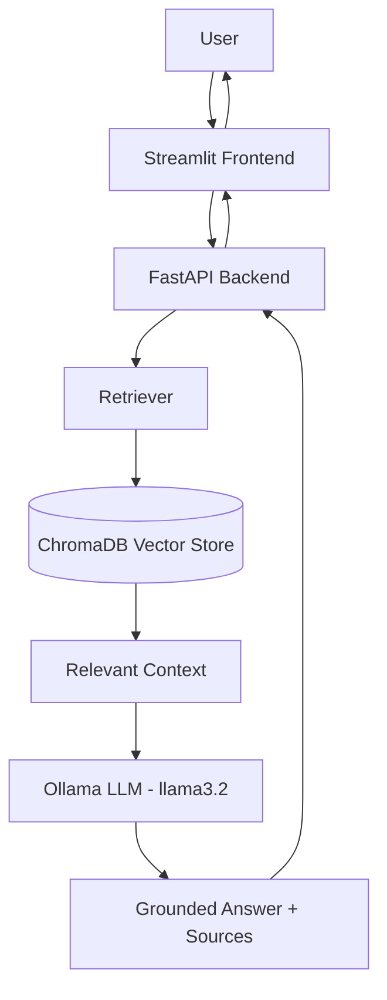

# PyTorch Docs RAG Assistant

A RAG-powered web application that answers questions about PyTorch documentation using a local LLM (Ollama + llama3.2). Users ask questions and get grounded answers with source citations.

## Architecture



The application follows a Retrieval-Augmented Generation (RAG) pipeline. The backend first retrieves relevant chunks from the persisted ChromaDB vector store, then passes the retrieved context to the local Ollama LLM to generate a grounded answer with source citations.

## Tech Stack

| Component    | Technology                                 |
| ------------ | ------------------------------------------ |
| Language     | Python 3.10+                               |
| Backend      | FastAPI                                    |
| Frontend     | Streamlit                                  |
| Vector Store | ChromaDB                                   |
| Embeddings   | Sentence-Transformers (`all-MiniLM-L6-v2`) |
| LLM          | Ollama (`llama3.2`)                        |
| PDF Parsing  | PyPDF                                      |
| Testing      | pytest                                     |

## Project Structure

```text
rag-assistant-project/
├── backend/
│   ├── app/
│   │   ├── __init__.py
│   │   ├── main.py                  # FastAPI app, CORS, startup loading
│   │   ├── api/
│   │   │   ├── __init__.py
│   │   │   └── routes/
│   │   │       ├── __init__.py
│   │   │       └── query.py          # GET /health, POST /query
│   │   ├── core/
│   │   │   ├── __init__.py
│   │   │   └── config.py             # Settings from .env
│   │   ├── schemas/
│   │   │   ├── __init__.py
│   │   │   └── query.py               # QueryRequest / QueryResponse
│   │   ├── services/
│   │   │   ├── __init__.py
│   │   │   ├── retrieval.py           # Load vector store, retrieve chunks
│   │   │   └── generation.py          # Call Ollama LLM, build answer
│   │   └── utils/
│   │       ├── __init__.py
│   │       └── logging_config.py
│   ├── tests/
│   │   ├── conftest.py
│   │   └── test_query.py              # API tests
│   ├── .env.example
│   ├── Dockerfile
│   └── requirements.txt
│
├── data/
│   ├── raw_docs/                       # Local PyTorch PDF corpus
│   └── vector_store/                   # Persisted ChromaDB
│
├── frontend/
│   ├── app.py                          # Streamlit chat interface
│   ├── api_client.py                   # Backend API wrapper
│   ├── .env.example
│   └── requirements.txt
│
├── notebooks/
│   └── rag_pipeline.ipynb              # Full RAG pipeline
│
├── docs/
│   └── screenshots/                    # Screenshots of the running app
│
├── .gitignore
├── pytest.ini
└── README.md
```

## Domain & Data

### Domain

PyTorch official documentation and tutorials.

### Source Documents

The project uses 10 PDF documents exported from the official PyTorch documentation site, covering:

* Tensors
* Automatic Differentiation (`autograd`)
* Building Neural Networks (`nn.Module`)
* Datasets & DataLoaders
* Optimizing Model Parameters
* Save and Load the Model
* Learning PyTorch with Examples
* Linear layer API reference
* Module API reference
* `torch.optim` API reference

### Dataset Statistics

* Total documents: 10
* Total pages: 123
* Cleaned chunks: 184

### How to Obtain the Data

The raw document corpus is intentionally excluded from the Git repository to keep the repository lightweight.

Download the required PyTorch documentation pages from:

* [PyTorch Tutorials](https://pytorch.org/tutorials/)
* [PyTorch Documentation](https://pytorch.org/docs/stable/)

Use your browser's **Print to PDF** or **Save as PDF** feature and place the resulting PDF files inside:

```text
data/raw_docs/
```

The filenames should correspond to the documents expected by the notebook.

### Chunking Strategy

The notebook uses paragraph-based chunking with:

* Maximum chunk size: 800 characters
* Chunk overlap: 150 characters
* Paragraphs shorter than 100 characters are merged

This approach preserves natural boundaries such as explanations and code examples while keeping chunks small enough for effective retrieval.

## Setup Instructions

### Prerequisites

Install the following:

* Python 3.10+
* Git
* Ollama

Install Ollama from the [official Ollama website](https://ollama.com/download).

### 1. Clone the Repository

```bash
git clone https://github.com/Doha-mostafaa/rag-assistant-project.git
cd rag-assistant-project
```

### 2. Create a Virtual Environment

```bash
python -m venv .venv
```

#### Windows

```bash
.venv\Scripts\activate
```

#### macOS / Linux

```bash
source .venv/bin/activate
```

### 3. Install Notebook Dependencies

```bash
pip install jupyter pandas numpy chromadb sentence-transformers pypdf ollama python-dotenv
```

### 4. Pull the Local LLM

Make sure Ollama is installed and running, then run:

```bash
ollama pull llama3.2
```

### 5. Prepare the Documents

Create the required folders if they do not already exist:

```text
data/raw_docs/
data/vector_store/
```

Place the downloaded PyTorch PDF documents inside:

```text
data/raw_docs/
```

### 6. Generate the Vector Store

Start Jupyter:

```bash
jupyter notebook notebooks/rag_pipeline.ipynb
```

Then run the notebook from top to bottom.

For a clean verification, use:

**Kernel → Restart & Run All**

The notebook performs:

1. Document loading
2. Text cleaning
3. Chunking
4. Embedding generation
5. ChromaDB vector-store creation
6. Retrieval testing
7. Evaluation

The persisted vector store is generated under:

```text
data/vector_store/
```

The backend loads this persisted vector store for retrieval.

## Backend Setup

From the project root:

```bash
cd backend
pip install -r requirements.txt
```

Create the environment file:

```bash
copy .env.example .env
```

On macOS/Linux:

```bash
cp .env.example .env
```

Adjust the settings if needed.

Start the FastAPI server:

```bash
uvicorn app.main:app --reload
```

The API will be available at:

```text
http://localhost:8000
```

Swagger API documentation:

```text
http://localhost:8000/docs
```

## Frontend Setup

Open a second terminal and activate the same virtual environment.

From the project root:

```bash
cd frontend
pip install -r requirements.txt
```

Create the environment file:

### Windows

```bash
copy .env.example .env
```

### macOS/Linux

```bash
cp .env.example .env
```

Set `API_BASE_URL` to the backend address if needed.

Start Streamlit:

```bash
streamlit run app.py
```

The application will normally be available at:

```text
http://localhost:8501
```

The frontend communicates with the backend using the `API_BASE_URL` environment variable rather than hard-coding the backend address in the application code.

## Environment Variables

### Backend — `backend/.env`

| Variable              | Description                                 | Default                  |
| --------------------- | ------------------------------------------- | ------------------------ |
| `VECTOR_STORE_PATH`   | Path to the persisted ChromaDB vector store | `../data/vector_store`   |
| `COLLECTION_NAME`     | ChromaDB collection name                    | `pytorch_docs`           |
| `EMBEDDING_MODEL`     | Sentence-transformers embedding model       | `all-MiniLM-L6-v2`       |
| `LLM_MODEL`           | Ollama model name                           | `llama3.2`               |
| `OLLAMA_HOST`         | Ollama server URL                           | `http://localhost:11434` |
| `RETRIEVAL_N_RESULTS` | Number of chunks retrieved per query        | `4`                      |

### Frontend — `frontend/.env`

| Variable       | Description         | Default                 |
| -------------- | ------------------- | ----------------------- |
| `API_BASE_URL` | FastAPI backend URL | `http://localhost:8000` |

Actual `.env` files are excluded from version control. Only `.env.example` files are committed.

## API Reference

### GET `/health`

Checks whether the FastAPI backend is running.

```bash
curl http://localhost:8000/health
```

Expected response:

```json
{
  "status": "ok"
}
```

### POST `/query`

Sends a question to the RAG pipeline and returns a grounded answer with source information.

```bash
curl -X POST http://localhost:8000/query \
  -H "Content-Type: application/json" \
  -d "{\"question\": \"How do I use autograd to compute gradients?\"}"
```

Example response:

```json
{
  "answer": "To use autograd to compute gradients, ...",
  "sources": [
    "Automatic Differentiation with torch.autograd — PyTorch Tutorials documentation.pdf"
  ]
}
```

### Error Responses

| Status Code | Meaning                                                      |
| ----------- | ------------------------------------------------------------ |
| `422`       | Invalid input, such as a missing or invalid `question` field |
| `503`       | Vector store or LLM service unavailable                      |
| `500`       | Unexpected internal server error                             |

## Evaluation Results

The RAG pipeline was evaluated using 10 questions covering different parts of the PyTorch documentation.

| #  | Question                                                   | Top Retrieved Source                          | Grounded? |
| -- | ---------------------------------------------------------- | --------------------------------------------- | --------- |
| 1  | How do I use autograd to compute gradients?                | Automatic Differentiation with torch.autograd | Yes       |
| 2  | What is the purpose of the DataLoader class?               | Datasets & DataLoaders                        | Yes       |
| 3  | How do I define a custom neural network using nn.Module?   | Learning PyTorch with Examples                | Yes       |
| 4  | What does the Linear layer do in PyTorch?                  | Build the Neural Network                      | Yes       |
| 5  | How do I save and load a trained model?                    | Save and Load the Model                       | Yes       |
| 6  | What optimizers are available in torch.optim?              | torch.optim                                   | Partial   |
| 7  | How do I create a tensor and check its shape?              | Tensors                                       | Yes       |
| 8  | What is the difference between a Dataset and a DataLoader? | Datasets & DataLoaders                        | Yes       |
| 9  | How do I disable gradient tracking in PyTorch?             | Optimizing Model Parameters                   | Yes       |
| 10 | What is the role of the loss function during training?     | Optimizing Model Parameters                   | Yes       |

### Summary

**9/10 answers were fully grounded.**

One question about the `torch.optim` API reference was partially grounded because of retrieval granularity on the longer reference document.

Increasing the retrieval count to 8 for broad API-reference queries improved retrieval quality. The detailed failure analysis and evaluation process are documented in section 2.6 of the notebook.

## Testing

Run the test suite from the project root:

```bash
pytest
```

The current test suite contains 4 tests covering:

* `test_health_check` — verifies `/health` returns `{"status": "ok"}`
* `test_query_invalid_input` — verifies invalid input returns `422`
* `test_query_happy_path` — verifies a valid query returns an answer and sources
* `test_query_empty_question` — verifies the empty-question edge case

The tests use mocked LLM calls, so a running Ollama server is not required for the test suite.

Current test result:

```text
4 passed
```

## Screenshots

### Streamlit Chat Interface


```markdown

```

### FastAPI Swagger Interface


```markdown

```

## Git & Repository Notes

The repository intentionally excludes:

* `.venv/`
* `__pycache__/`
* `.env`
* Log files
* The raw PyTorch document corpus
* Large generated vector-store files

The raw documents can be obtained using the instructions in the **Domain & Data** section, and the vector store can be regenerated by running the notebook.

Small project files and artifacts below GitHub's file-size limits may be committed when appropriate.

## End-to-End RAG Flow

The complete application flow is:

```text
User Question
     ↓
Streamlit Frontend
     ↓
FastAPI /query
     ↓
ChromaDB Retrieval
     ↓
Relevant Document Chunks
     ↓
Ollama llama3.2
     ↓
Grounded Answer + Sources
     ↓
Streamlit Frontend
```

The LLM receives the retrieved document context as part of the RAG pipeline, allowing the application to answer questions based on the PyTorch documentation corpus rather than relying only on the model's general knowledge.

## License

MIT
