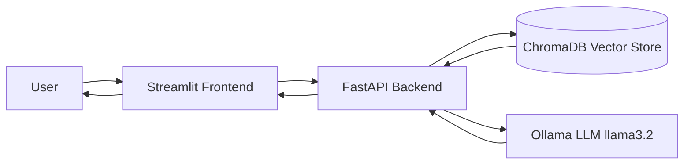

# PyTorch Docs RAG Assistant

A RAG-powered web application that answers questions about PyTorch documentation using a local LLM (Ollama + llama3.2). Users ask questions and get grounded answers with source citations.

## Architecture



## Tech Stack

| Component | Technology |
|---|---|
| Language | Python 3.10+ |
| Backend | FastAPI |
| Frontend | Streamlit |
| Vector Store | ChromaDB |
| Embeddings | Sentence-Transformers (all-MiniLM-L6-v2) |
| LLM | Ollama (llama3.2) |
| PDF Parsing | PyPDF |

## Project Structure

```
rag-assistant-project/
├── backend/
│   ├── app/
│   │   ├── __init__.py
│   │   ├── main.py                  # FastAPI app, CORS, startup loading
│   │   ├── api/
│   │   │   ├── __init__.py
│   │   │   └── routes/
│   │   │       ├── __init__.py
│   │   │       └── query.py         # GET /health, POST /query
│   │   ├── core/
│   │   │   ├── __init__.py
│   │   │   └── config.py            # Settings from .env
│   │   ├── schemas/
│   │   │   ├── __init__.py
│   │   │   └── query.py             # QueryRequest / QueryResponse
│   │   ├── services/
│   │   │   ├── __init__.py
│   │   │   ├── retrieval.py         # Load vector store, retrieve chunks
│   │   │   └── generation.py        # Call Ollama LLM, build answer
│   │   └── utils/
│   │       ├── __init__.py
│   │       └── logging_config.py
│   ├── tests/
│   │   ├── conftest.py
│   │   └── test_query.py            # 4 tests: health, invalid, happy path, edge case
│   ├── .env.example
│   ├── Dockerfile
│   └── requirements.txt
├── data/
│   ├── raw_docs/                    # 10 PyTorch PDF documents (see below)
│   └── vector_store/                # Persisted ChromaDB (generated by notebook)
├── frontend/
│   ├── app.py                       # Streamlit chat interface
│   ├── api_client.py                # Backend API wrapper
│   ├── .env.example
│   └── requirements.txt
├── notebooks/
│   └── rag_pipeline.ipynb           # Full RAG pipeline: load, chunk, embed, evaluate
├── .gitignore
└── README.md
```

## Domain & Data

**Domain:** PyTorch official documentation and tutorials.

**Source documents:** 10 PDF files exported from the official PyTorch documentation site, covering:
- Tensors
- Automatic Differentiation (autograd)
- Building Neural Networks (nn.Module)
- Datasets & DataLoaders
- Optimizing Model Parameters
- Save and Load the Model
- Learning PyTorch with Examples
- Linear layer API reference
- Module API reference
- torch.optim API reference

**Stats:** 123 total pages across 10 documents, cleaned and split into 184 chunks.

**How to obtain the data:** Download PDFs from the [official PyTorch tutorials](https://pytorch.org/tutorials/) and [API docs](https://pytorch.org/docs/stable/) pages using your browser's "Print to PDF" or "Save as PDF" feature. Place them in `data/raw_docs/`.

**Chunking strategy:** Paragraph-based chunking with 800-character max chunk size and 150-character overlap. Paragraphs shorter than 100 characters are merged. This preserves natural boundaries (code examples, explanations) while keeping chunks small enough for effective retrieval.

## Setup Instructions

### Prerequisites
- Python 3.10+
- Ollama installed and running ([install guide](https://ollama.com/download))
- Git

### 1. Clone & Create Environment
```bash
git clone https://github.com/<your-username>/rag-assistant-app.git
cd rag-assistant-app
python -m venv .venv
# Windows:
.venv\Scripts\activate
# macOS / Linux:
# source .venv/bin/activate
pip install jupyter pandas numpy chromadb sentence-transformers pypdf ollama python-dotenv
```

### 2. Pull the LLM Model
```bash
ollama pull llama3.2
```

### 3. Generate the Vector Store
```bash
# Place your PyTorch PDF documents in data/raw_docs/
# Then run the notebook top-to-bottom:
jupyter notebook notebooks/rag_pipeline.ipynb
# Kernel → Restart & Run All
# The vector store will be saved to data/vector_store/
```

### 4. Backend Setup
```bash
cd backend
pip install -r requirements.txt
cp .env.example .env        # adjust settings if needed
uvicorn app.main:app --reload
# API available at http://localhost:8000
# Swagger docs at http://localhost:8000/docs
```

### 5. Frontend Setup
```bash
cd frontend
pip install -r requirements.txt
cp .env.example .env        # set API_BASE_URL if backend is not on localhost:8000
streamlit run app.py
# App available at http://localhost:8501
```

## Environment Variables

### Backend (`backend/.env`)

| Variable | Description | Default |
|---|---|---|
| `VECTOR_STORE_PATH` | Path to ChromaDB vector store | `../data/vector_store` |
| `COLLECTION_NAME` | ChromaDB collection name | `pytorch_docs` |
| `EMBEDDING_MODEL` | Sentence-transformers model | `all-MiniLM-L6-v2` |
| `LLM_MODEL` | Ollama model name | `llama3.2` |
| `OLLAMA_HOST` | Ollama server URL | `http://localhost:11434` |
| `RETRIEVAL_N_RESULTS` | Chunks to retrieve per query | `4` |

### Frontend (`frontend/.env`)

| Variable | Description | Default |
|---|---|---|
| `API_BASE_URL` | Backend API URL | `http://localhost:8000` |

## API Reference

### GET /health
Returns API health status.
```bash
curl http://localhost:8000/health
# {"status": "ok"}
```

### POST /query
Send a question and get a grounded answer with sources.
```bash
curl -X POST http://localhost:8000/query \
  -H "Content-Type: application/json" \
  -d '{"question": "How do I use autograd to compute gradients?"}'
```
Response:
```json
{
  "answer": "To use autograd to compute gradients, ...",
  "sources": ["Automatic Differentiation with torch.autograd — PyTorch Tutorials 2.14.0+cu130 documentation.pdf"]
}
```

### Error Responses

| Code | Meaning |
|---|---|
| `422` | Invalid input (missing or wrong `question` field) |
| `503` | Vector store or LLM service unavailable |
| `500` | Unexpected internal error |

## Evaluation Results

| # | Question | Top Retrieved Source | Grounded? |
|---|----------|----------------------|-----------|
| 1 | How do I use autograd to compute gradients? | Automatic Differentiation with torch.autograd | ✅ Yes |
| 2 | What is the purpose of the DataLoader class? | Datasets & DataLoaders | ✅ Yes |
| 3 | How do I define a custom neural network using nn.Module? | Learning PyTorch with Examples | ✅ Yes |
| 4 | What does the Linear layer do in PyTorch? | Build the Neural Network | ✅ Yes |
| 5 | How do I save and load a trained model? | Save and Load the Model | ✅ Yes |
| 6 | What optimizers are available in torch.optim? | torch.optim | ⚠️ Partial |
| 7 | How do I create a tensor and check its shape? | Tensors | ✅ Yes |
| 8 | What is the difference between a Dataset and a DataLoader? | Datasets & DataLoaders | ✅ Yes |
| 9 | How do I disable gradient tracking in PyTorch? | Optimizing Model Parameters | ✅ Yes |
| 10 | What is the role of the loss function during training? | Optimizing Model Parameters | ✅ Yes |

**9/10 answers fully grounded.** 1 partial due to retrieval granularity on long reference docs (torch.optim). Mitigation: increased `n_results` to 8 for broad API-reference queries improved retrieval quality. See notebook section 2.6 for detailed failure analysis.

## Testing
```bash
cd backend
pytest tests/ -v
```

Tests use mocked LLM calls (no running Ollama required for pytest):
- `test_health_check` — verifies `/health` returns `{"status": "ok"}`
- `test_query_invalid_input` — verifies missing `question` field returns 422
- `test_query_happy_path` — verifies valid query returns answer + sources
- `test_query_empty_question` — verifies edge case of empty string question

## License
MIT
